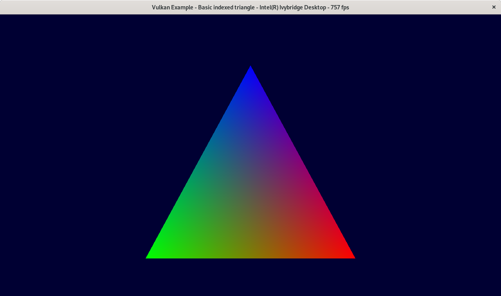
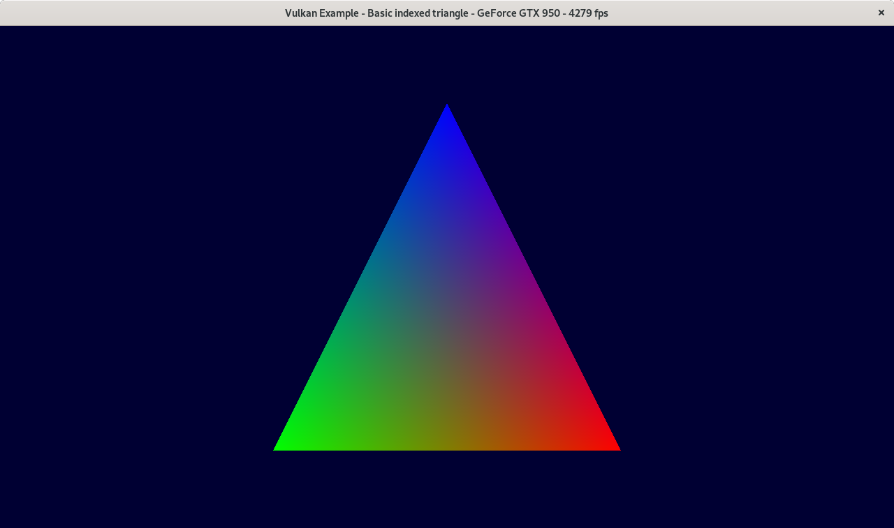
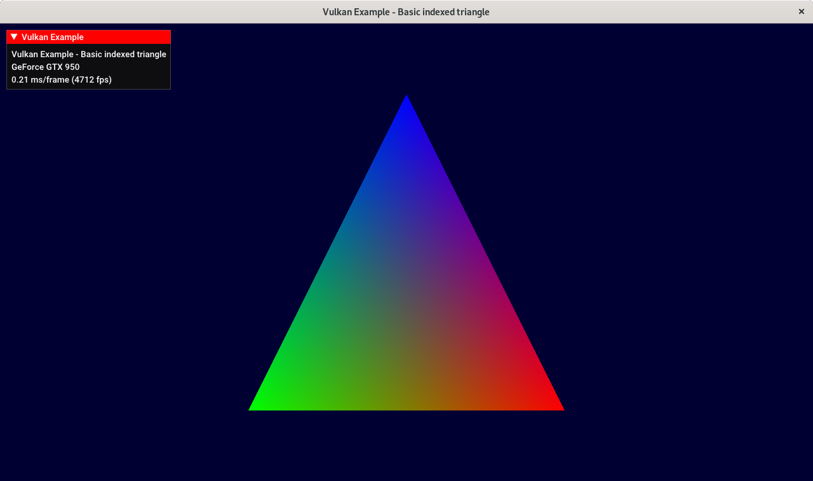
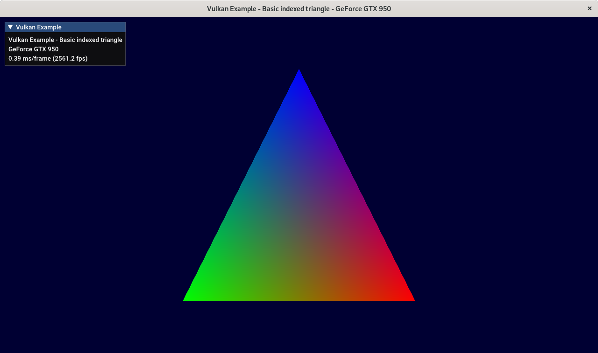
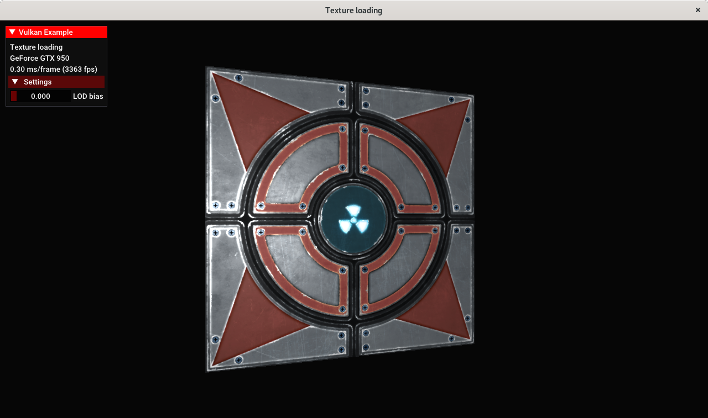
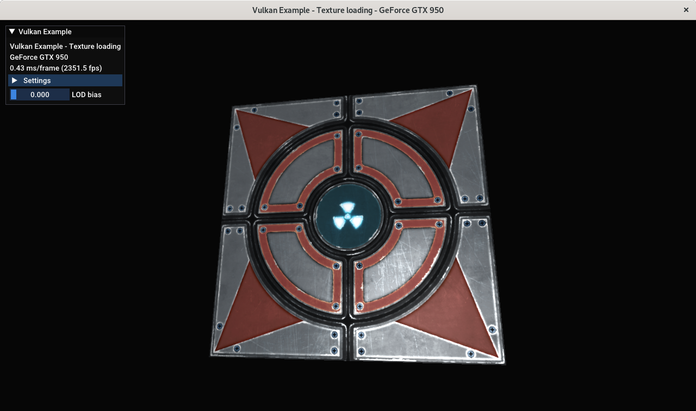
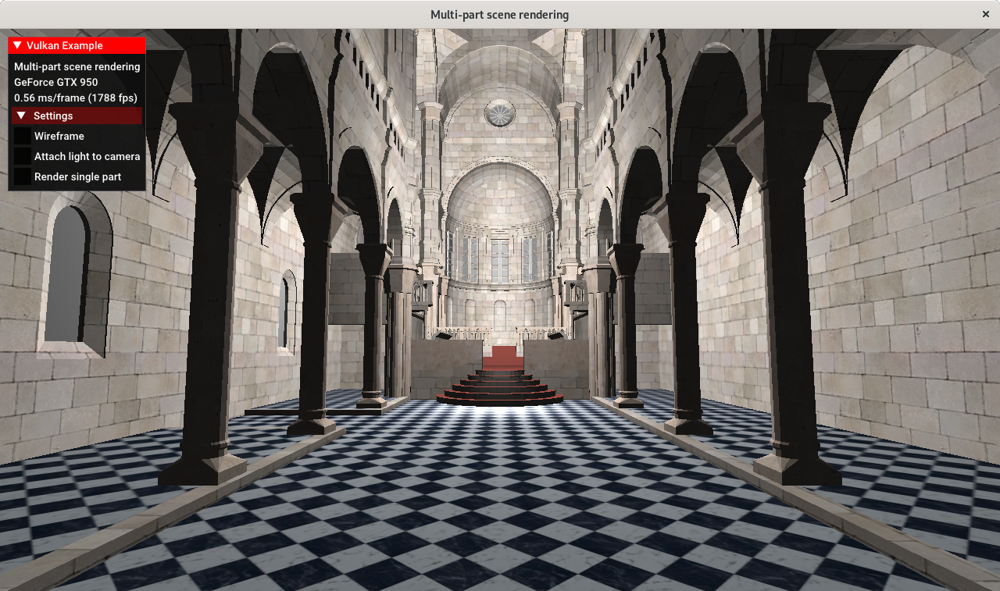
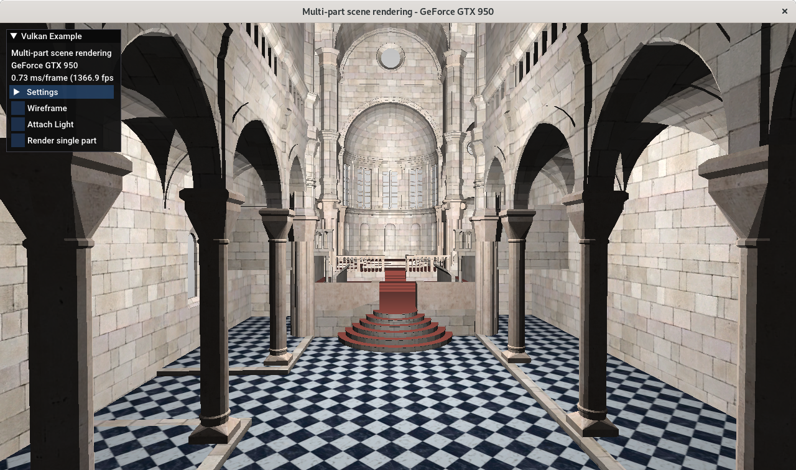

# pyvk : Python Vulkan examples and demos

`pyvk` is a Python port of the wonderful framework from [Sascha Willems vulkan examples](https://github.com/SaschaWillems/Vulkan).
It has been started as a mean for me to discover Vulkan. The initial objectives were:
- use some of the proposed classes to ease development (but some classes require stuff not ported to python (gli?))
- part of these classes are in a `vks` namespace, thus make a `vks` python module
- port the main class (`VulkanExampleBase`) to Python
- try to implement `triangle` and `scenerendering`

### Current status
Essential classes have been ported to Python in a `vks` Pyhton module, and the `triangle`, `texture` and `scenerendering` examples are running.
Moreover `imgui` integration is also effective (included in the `triangle` demo). However not every methods have yet been rewritten in those classes. For instance there is no benchmarking facilities.

Only the XCB platform binding has been made, so this only runs on `linux`. It has been tested under Fedora 30 and Ubuntu 18.04, using  both IGP Intel drivers and nvidia proprietary drivers.

###### *FPS comparisons with the C++ original examples*
These are Frames Per Second values computed in the program itself.
They are read directly from the [screenshots](#screenshots). All FPS values here are stable during one execution, but there are some differences between executions (GPU Temp?). Min/Max frame times may also be added.

| Example | CPU-Card-Driver-platform-os | C++ | Python |
|---------|-----------------------------|-----|--------|
| triangle | i3 3220T-IGP-Intel Ivybridge-XCB-linux |798 | 757 |
| triangle (imgui) | i3 3220T-IGP-Intel Ivybridge-XCB-linux |637 | 427 |
| triangle | Pentium G4400-GTX950-nvidia proprietary-XCB-linux |4794 | 4279 |
| triangle (imgui) | Pentium G4400-GTX950-nvidia proprietary-XCB-linux |4712 | 2561 |
| texture | Pentium G4400-GTX950-nvidia proprietary-XCB-linux |3400 | 2800 |
| scenerendering | Pentium G4400-GTX950-nvidia proprietary-XCB-linux | 1800 | 1330 |

**Note**: All C++ examples were run without validation enabled, whereas Python examples were run with validation enabled.

### Running the example(s)
*First install the requirements (see [below](#installation-requirements)).
At the moment I also use [numpy](https://numpy.org/) as a mean to access C arrays from Python, thus you should also install it (`pip3 install --user numpy`).*

Simply clone the repository in a directory of your choice and change directory
```
git clone https://github.com/geehalel/pyvk.git
cd pyvk
```
then run the desired demo
```
python3 triangle.py
```

### Installation requirements

- install [python vulkan binding](https://github.com/realitix/vulkan)
```
pip3 install vulkan --user
```
- install [python xcb binding](https://github.com/tych0/xcffib)
```
pip3 install xcffib --user
```
- install [python glm binding](https://github.com/Zuzu-Typ/PyGLM)
```
pip3 install pyglm --user  
```
- install [python imgui binding](https://github.com/swistakm/pyimgui)
```
pip3 install imgui --user
```
- install [python wayland binding](https://github.com/flacjacket/pywayland) (not useful for now)
```
pip3 install pywayland --user
```

  ##### 3D Model loading
  Install the [`assimp` python port](https://github.com/assimp/assimp) from your distribution (`python3-pyassimp`) or from `Pypi`.
  ```
  apt-get install python3-pyassimp
  ```

  ##### Textures loading
  The tutorials mainly use the Khronos groupe `ktx` format for storing textures,
but this format is not installed on Linux (no packages on Ubuntu and Fedora).
The python `vks` module here includes a simple class in `ktxfile.py` to load such textures.
Here are some links about this format:
  - [`KTX` File format specification](https://www.khronos.org/opengles/sdk/tools/KTX/file_format_spec/)
  - [The Khronos Group Library and Tools](https://github.com/KhronosGroup/KTX-Software) which contains source code for `libktx` library
  - [OpenGL Image](http://gli.g-truc.net/0.8.2/index.html) (`gli`) library, C++ header only, used in the tutorials

  There are otherwise numerous image libraries in Python, none of them reading `ktx` files, but some of them reading `dds` files (Microsoft texture file format).
  - [Pillow, the Python Image Library](https://github.com/python-pillow/Pillow)
  - [OpenImageIO](https://github.com/OpenImageIO/oiio) which supports image formats used in VFX (visual effects for films/TV) and embeds an ImageCache framework. Supports Python directly. On Ubuntu the Python support is only packaged for Python 2.7 (`python-openimageio`). For Python 3, a [package](https://github.com/fredrikaverpil/oiio-python) may be manually installed:
  ```
  wget https://github.com/fredrikaverpil/oiio-python/releases/download/2.0.5%2B20190203/oiio-2.0.5-cp36-none-linux_x86_64.whl
  pip3 install --user oiio-2.0.5-cp36-none-linux_x86_64.whl
  ```
  Check your Python version, there is also a wheel for Python 3.7.

### Screenshots

These are comparative screenshots of the original examples written in C++ and the ones here written in Python.

- Core i3-3220T, IGP, Intel Ivybridge, XCB, linux

|Example | C++ | Python |
|--------|-----|--------|
|triangle |  |  |
|triangle (imgui) |  |  |

- Pentium G4400, GTX950, nvidia proprietary, XCB, linux

|Example | C++ | Python |
|--------|-----|--------|
|triangle |  |  |
|triangle (imgui) |  |  |
|texture|  |  |
|scenerendering |  |  |
